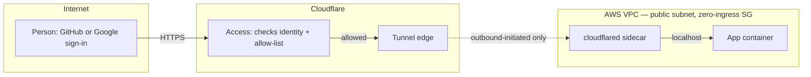

# Zero-Inbound Network

**Classification:** factory-output
**Lifecycle:** active
**Owner:** hekton
**Promotion target:** `none`

> A public, sanitized reference implementation of a zero-inbound AWS network fronted by Cloudflare Access, with GitHub+Google SSO and per-app Terraform module reuse

## What this is

A small, self-hosted app (or several) that needs to be reachable by exactly one or two
named people, and unreachable by anyone else — no public listener, no VPN client to
install, no second AWS account. The pattern:

1. Run the app on **ECS Fargate** with a **`cloudflared` sidecar** in the same task.
2. Give the task's security group **zero ingress rules**. Nothing can reach it directly —
   the only path in is the *outbound-initiated* Cloudflare Tunnel the sidecar opens.
3. Put **Cloudflare Access** in front of the tunnel's hostname, with two identity
   providers wired in parallel — GitHub OAuth and Google OAuth — so either sign-in method
   gets a named, allow-listed person through.
4. Give CI a **GitHub Actions OIDC** role instead of a long-lived AWS access key, scoped to
   one repo.
5. Wrap all four of the above in one reusable Terraform module (`modules/hosted-app/`) so
   a second app is one more module block, not a second copy of the pattern.



The security group has no `ingress` block at all — that absence *is* the control. There's
no NAT gateway either: nothing inside ever needs to be reached from outside except through
the tunnel, so there's no inbound path to defend and no NAT to pay for. See
[`docs/well-architected.md`](docs/well-architected.md) for what that single-control tradeoff
costs, and when it stops being the right call.

**The dark switch:** each app's `desired_count` is the on/off switch. At `0`, the task
definition, ECR repo, DNS record, and Access policy all still exist — nothing is running
and nothing is billable. Set it to `1` and the app is live behind Access within about a
minute, with no infrastructure to stand up.

## Implementation Status

- Scaffolded 2026-08-28. Terraform (root + `modules/hosted-app/`) written and
  `terraform validate`-clean; **not applied anywhere** — this repo ships as a reference to
  read and adapt, not a deploy-as-is stack. See `infra/terraform/terraform.tfvars.example`.
- **This is a standalone example, by design.** It has no Terraform backend configured
  (`infra/terraform/versions.tf`), no reference to any shared state bucket, and no
  module source pointing anywhere outside this repo — clone it, and every `source =`
  in the codebase resolves to a local relative path. Nothing here depends on, or writes
  to, any private infrastructure this repo's author may otherwise operate.

## Quick Start

```bash
cd infra/terraform
terraform init -backend=false     # no backend configured — see docs/well-architected.md "State"
terraform validate                # no AWS/Cloudflare credentials needed
cp terraform.tfvars.example terraform.tfvars   # then fill in real values, or use TF_VAR_*
terraform plan                    # needs real credentials from here on
# terraform apply                 # left commented on purpose — read docs/well-architected.md first
```

## Key Docs

- [Architecture](docs/architecture.md) — components, data flow, the reuse story
- [Well-Architected notes](docs/well-architected.md) — tradeoffs, cost, security, what this doesn't solve
- [Decisions](docs/decisions.md)
- [Risks](docs/risks.md)
- [Next Actions](docs/next-actions.md)
- [Contributing](CONTRIBUTING.md) — how to propose a change, and what to expect from a solo maintainer
- [Code of Conduct](CODE_OF_CONDUCT.md)

